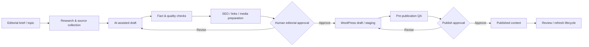

# BalkansNetwork Content Automation — Portfolio Showcase

> **Portfolio showcase only.** This repository documents the architecture and design principles of a real internal editorial automation project. It intentionally does **not** contain production source code, workflow exports, prompts, credentials, endpoints, provider identifiers, publishing rules, private datasets, or other proprietary implementation details.

## What this project demonstrates

A controlled AI-assisted content operations system for a business publication focused on the Balkans and Southeast Europe.

The system was designed to reduce repetitive editorial work while preserving human control over research quality, factual accuracy, SEO, media, publishing and brand standards.

### Capabilities demonstrated

- AI-assisted editorial workflow design
- Content research and structured drafting
- Source-quality and verification controls
- Human-in-the-loop review and approval
- SEO metadata and internal-link preparation
- Media and featured-image workflow coordination
- WordPress integration
- Content lifecycle and status management
- Quality-control gates before publication
- Scheduled review / refresh logic for time-sensitive content
- Modular automation architecture
- Migration from fragmented automations toward maintainable services

## High-level architecture

The real production system contains substantially more rules and implementation detail. This public repository shows the **automation pattern and engineering decisions**, not the implementation recipe.

## My role

**AI Automation Consultant & Workflow Designer**

I designed the automation architecture around the editorial process: separating research, drafting, validation, SEO, media, publishing and review into controlled stages rather than treating content generation as a single AI prompt.

A central design goal was to automate repetitive work **without allowing automation to bypass editorial judgement**. The system therefore uses explicit quality checks, human approval states and safe failure behaviour before publication.

## Technologies / capability areas

- n8n and workflow orchestration concepts
- WordPress integration
- REST APIs and webhooks
- AI-assisted content operations
- Structured content state
- SEO automation
- Media workflow coordination
- Human approval gates
- Quality-control automation

Exact production configuration, plugin code, prompts, endpoints and editorial rules are intentionally not published.

## Design principles

1. **Research before generation** — content should be grounded in identifiable sources rather than produced from an unconstrained prompt.
2. **Facts and interpretation are separated** — automation supports editorial analysis but does not blur source material with conclusions.
3. **Human approval remains decisive** — publishing is not an unattended AI action.
4. **Freshness is part of quality** — time-sensitive information should carry a review lifecycle rather than remain indefinitely static.
5. **SEO is integrated, not bolted on** — metadata, linking and content structure are prepared as part of the editorial workflow.
6. **Failure should stop publication** — missing required inputs or failed checks should not silently produce a public article.
7. **Modular services beat one large workflow** — editorial, media, SEO and publishing responsibilities are separated for maintainability.

## What is intentionally not public

- Production source code or WordPress plugin files
- Production n8n workflow JSON
- API keys, tokens or credential names
- Webhook URLs, infrastructure addresses or server paths
- Prompt libraries and system instructions
- Detailed source-selection or scoring rules
- Editorial formulas, topic-mix rules or publishing priorities
- Full validation, retry or fallback logic
- Internal taxonomies and content schemas
- Client, contributor or business-confidential data
- Production logs, analytics or databases

## Commercial use

This repository is a portfolio case study, not an open-source distribution of the production system. The underlying implementation, editorial methodology and automation logic remain proprietary.

For consulting or implementation work involving n8n, WordPress automation, AI-assisted content operations, editorial workflow redesign or API integration, contact me through my professional profile.
